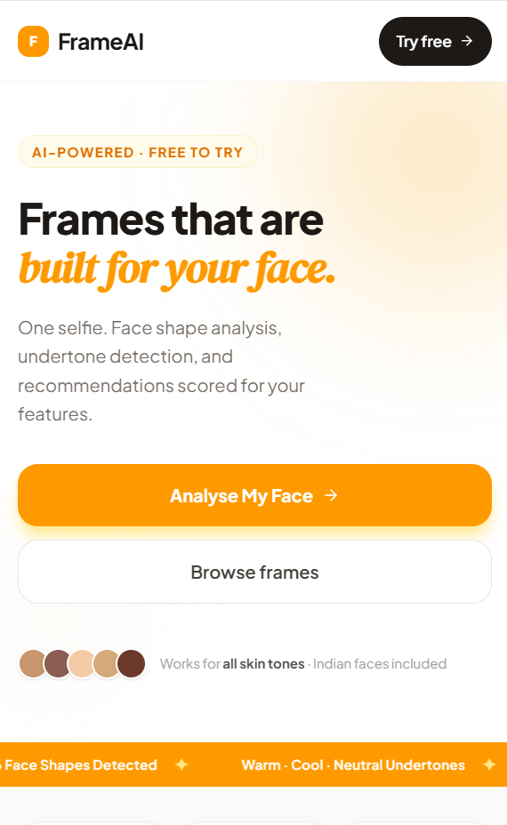
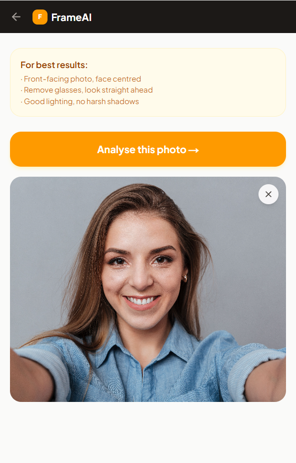
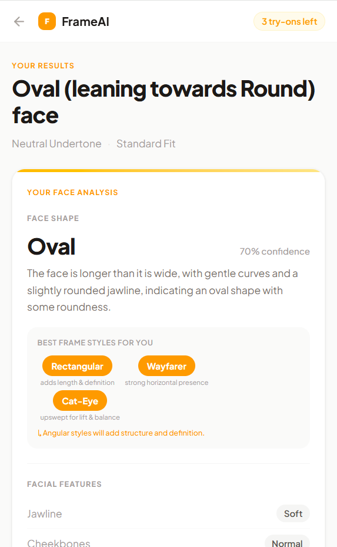
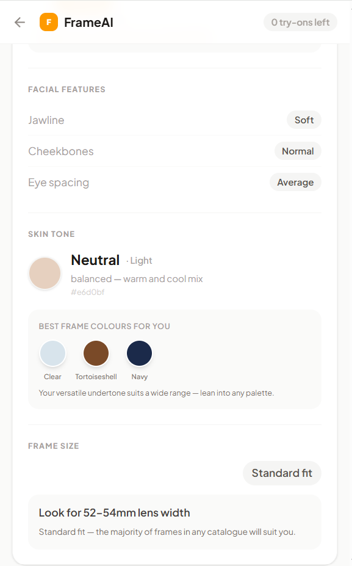
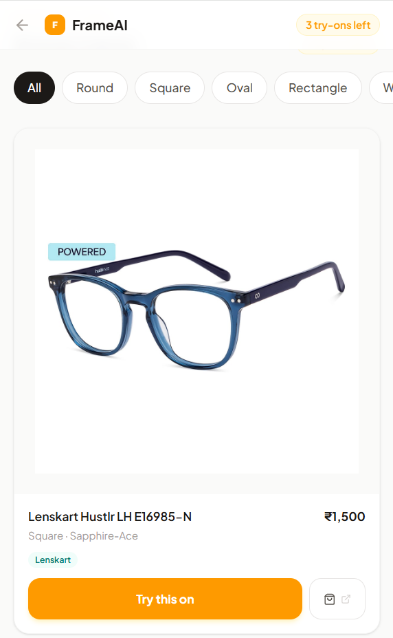
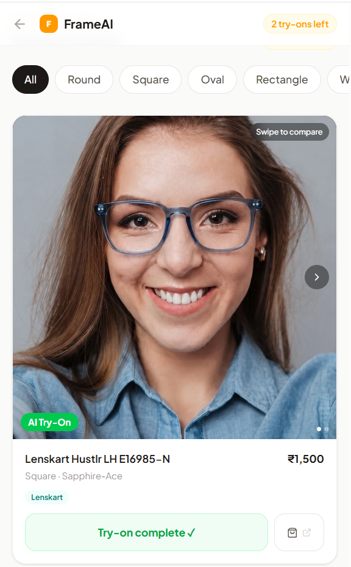
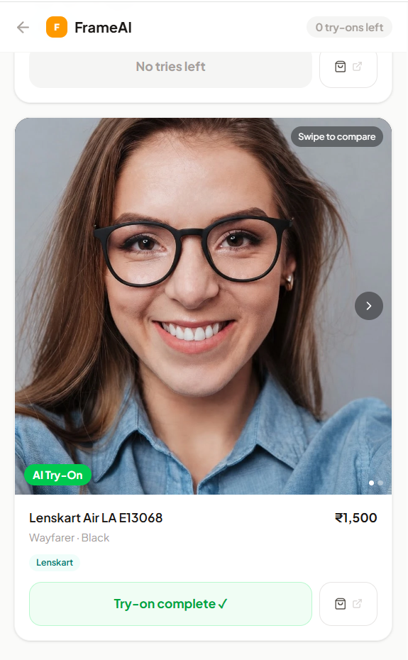
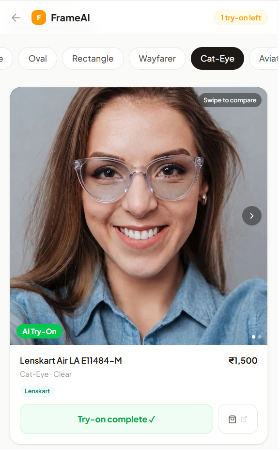

# FrameAI

**Find eyeglass frames that actually suit your face — from one selfie.**

FrameAI analyses your face shape and skin undertone from a single photo, recommends frames scored specifically for your features, and generates a photorealistic image of you wearing your chosen pair — before you buy.

🔗 **Live app:** [frame-ai-zeta.vercel.app](https://frame-ai-zeta.vercel.app)

---

## Screenshots

<table>
  <tr>
    <td width="25%"><br /><sub><b>Homepage</b> — the pitch and entry point</sub></td>
    <td width="25%"><br /><sub><b>Selfie capture</b> — in-browser camera or upload</sub></td>
    <td width="25%"><br /><sub><b>Face analysis</b> — shape, confidence, best styles</sub></td>
    <td width="25%"><br /><sub><b>Recommendations</b> — undertone, colours, fit</sub></td>
  </tr>
  <tr>
    <td width="25%"><br /><sub><b>Catalogue</b> — browse and filter by style</sub></td>
    <td width="25%"><br /><sub><b>AI try-on</b> — square frame, photorealistic</sub></td>
    <td width="25%"><br /><sub><b>AI try-on</b> — wayfarer frame</sub></td>
    <td width="25%"><br /><sub><b>AI try-on</b> — cat-eye frame</sub></td>
  </tr>
</table>

---

## The problem

Buying glasses online is a guessing game. AR try-on tools look plasticky and unreal, and nothing tells you *why* a frame does or doesn't suit you. FrameAI replaces the guesswork with an actual analysis, then shows you a realistic result instead of a cartoon overlay.

## How it works

```
1. User takes a selfie (in-browser camera with an oval alignment guide, or uploads a photo)
2. Backend analyses the photo:
     — Face shape (6 classes: Oval, Round, Square, Heart, Diamond, Oblong)
     — Skin undertone (Warm / Cool / Neutral) + skin depth
     — Jawline, cheekbones, eye spacing, recommended frame size
3. Frames are scored against that analysis and the top matches are shown,
   with plain-English reasoning for each recommendation
4. User picks a frame → FrameAI generates a photorealistic image of them
   wearing it (not an AR sticker — an actual AI-composited photo)
5. Direct link to buy the frame from the retailer
```

Anonymous sessions get **3 free try-on generations**, enforced server-side (not just in the UI).

---

## Tech stack

**Frontend** — Next.js 16 (App Router) · React 19 · TypeScript · Tailwind CSS v4 · Framer Motion · shadcn/ui · TensorFlow.js BlazeFace (client-side camera alignment only)

**Backend** — FastAPI (Python 3.11) · Supabase (Postgres) · Cloudflare R2 (object storage) · OpenCV (local image validation) · Segmind API (Gemini 2.5 Flash Lite for face/undertone analysis, Nano Banana for photorealistic try-on generation) · slowapi (rate limiting) · Celery + Redis (optional, for queued generation at scale)

**Deployment** — Frontend on Vercel · Backend on Render

---

## Project structure

```
FrameAI/
├── frontend/                      Next.js app
│   ├── app/
│   │   ├── page.tsx                 Homepage
│   │   ├── analyse/                 Camera capture + consent flow
│   │   ├── analysis/[jobId]/        Results + frame try-on
│   │   ├── contact/ privacy/ terms/
│   ├── components/
│   │   ├── home/                    Hero, live-demo orbit, catalogue, how-it-works
│   │   ├── camera/                  Camera view, oval guide, upload fallback
│   │   ├── frames/                  Frame cards, generation modal, try-on catalogue
│   │   ├── analysis/                Analysis result card
│   │   └── ui/                      shadcn primitives
│   └── lib/                         API client, motion variants, style-guide logic
│
├── backend/                        FastAPI app
│   ├── main.py                      App entrypoint, CORS, rate-limit handler
│   ├── api/                         upload · analysis · recommendations · generate · catalogue · session
│   ├── services/
│   │   ├── face_analysis.py          Image validation (resolution/blur/face count) + Gemini vision call
│   │   ├── recommender.py            Frame scoring/ranking engine
│   │   ├── generation.py             Segmind try-on image generation
│   │   ├── storage.py                Cloudflare R2 operations
│   │   └── undertone.py              Skin undertone colour analysis
│   ├── db/                          Supabase client + seed data
│   ├── models/schemas.py            Pydantic request/response models
│   └── tests/                       pytest suite
│
├── scraper/                        Frame catalogue scrape → process → annotate → load pipeline
│
├── SPEC.md, PRD.md, TECH_STACK.md,
├── API_CONTRACT.md, RECOMMENDATION_RULES.md,
├── Data Pipeline.md, SPRINT_PLAN.md   Full product/engineering documentation
└── render.yaml                      Render deployment config
```

---

## API overview

All endpoints are prefixed at the backend root (no `/api` prefix). Full request/response schemas are in [`API_CONTRACT.md`](API_CONTRACT.md).

| Method | Endpoint | Purpose |
|---|---|---|
| `POST` | `/upload` | Upload a selfie, validate it, kick off face analysis |
| `GET` | `/analysis/{job_id}` | Poll analysis results |
| `GET` | `/session` | Current session's remaining try-on generations |
| `GET` | `/recommendations/{job_id}` | Scored frame recommendations for a completed analysis |
| `POST` | `/generate` | Request a photorealistic try-on for a chosen frame (rate-limited, 3/session) |
| `GET` | `/generate/{task_id}` | Poll generation status |
| `GET` | `/catalogue` | Browse the frame catalogue (filterable by style) |
| `GET` | `/catalogue/styles` | List available frame styles |

---

## Getting started

### Prerequisites
- Node.js 18+
- Python 3.11
- Accounts: Supabase, Cloudflare R2, Segmind (all have free tiers)

### Backend

```bash
cd backend
pip install -r requirements.txt
cp .env.example .env   # fill in your own Supabase / R2 / Segmind credentials
uvicorn main:app --reload --port 8000
```

### Frontend

```bash
cd frontend
npm install
cp .env.local.example .env.local   # point NEXT_PUBLIC_API_URL at your backend
npm run dev
```

The app will be running at `http://localhost:3000`, talking to the backend at `http://localhost:8000`.

### Tests

```bash
cd backend
pytest tests/ -v
```

---

## Environment variables

Never commit real values — both `.env` (backend) and `.env.local` (frontend) are gitignored. Use the `.env.example` / `.env.local.example` templates.

**Backend** (`backend/.env`):

| Variable | Purpose |
|---|---|
| `SUPABASE_URL`, `SUPABASE_SERVICE_KEY` | Database access |
| `R2_ACCOUNT_ID`, `R2_ACCESS_KEY_ID`, `R2_SECRET_ACCESS_KEY`, `R2_BUCKET_NAME`, `R2_PUBLIC_DOMAIN` | Cloudflare R2 object storage |
| `SEGMIND_API_KEY` | Face analysis + try-on generation |
| `REDIS_URL` | Only needed if `USE_CELERY=true` |
| `SESSION_SECRET` | Session cookie signing |
| `ALLOWED_ORIGINS` | Comma-separated CORS allowlist — must include your deployed frontend URL |
| `ENVIRONMENT` | `development` or `production` |

**Frontend** (`frontend/.env.local`):

| Variable | Purpose |
|---|---|
| `NEXT_PUBLIC_API_URL` | Backend base URL |

---

## Notes on the current implementation

- Face shape and undertone analysis runs entirely through a hosted vision-language model (Segmind's Gemini 2.5 Flash Lite) — there's no local ML model inference for this step, keeping the backend lightweight enough to run on a free-tier instance.
- Uploaded photos are downscaled to a maximum 1600px edge before any processing, to keep memory use bounded regardless of the original photo's resolution.
- InsightFace is referenced in a couple of research/exploration files but is **not** part of the production analysis pipeline.
- Generated try-on images and uploaded selfies expire from storage after 24 hours.

---

## Team

Built by **Aditya Kakade**, **Kalpesh Pawar**, and **Akhilesh Shinde**. See the [contact page](https://frame-ai-zeta.vercel.app/contact) on the live app.

## License

MIT — see [LICENSE](LICENSE).
